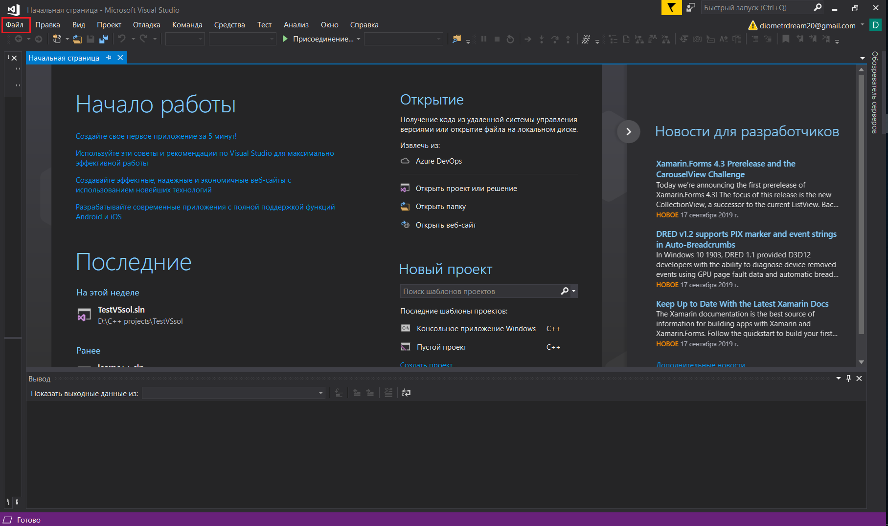
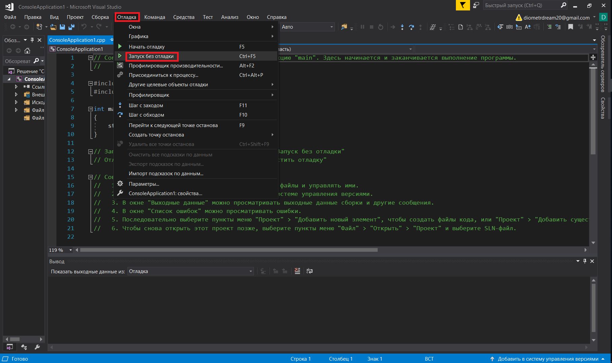

**МИНИСТЕРСТВО ОБРАЗОВАНИЯ И НАУКИ**

**РОССИЙСКОЙ ФЕДЕРАЦИИ**

**ФГАОУ ВО «Крымский федеральный университет имени В. И. Вернадского»**

**Физико-технический институт**

**Кафедра компьютерной инженерии и моделирования**

**ОТЧЕТ**

по лабораторной работе «Изучение базовых возможностей MS Visual Studio.»

по дисциплине &quot;Программирование&quot;
Выполнил студент 1 курса

Группы ПИ-б-о-191(2)

Кравченко Дмитрий Сергеевич.

Симферополь, 2019

### Цель: изучить основные возможности создания и отладки программ в IDE MS Visual Studio.

### Ход работы:

#### Ответ на вопрос №1:

Чтобы создать консольное приложение C++ нужно открыть пункт главного меню с названием **Файл**.  
В появившемся списке нужно выбрать пункт **Создать -> Проект**.  
В появившемся диалоговом окне нужно выбрать пункт "Консольное приложение Windows". Это диалоговое окно так же можно вызвать оновременно нажав **Ctrl + Shift + N**.  
Последним пунктом нужно нажать клавишу Enter.

  
_Рис. 1\. Пункт **Файл** главного меню_  
  
_Рис. 2\. Команда **Создать -> Проект**_  
  
_Рис. 3\. Диалоговое окно создания проектов, выбор консольного приложения_  

#### Ответ на вопрос №2:

Чтобы изменить цветовую схему редактора нужно вызвать диалоговое окно настроек. Это можно сделать из пункта главного меню **Отладка**.  
В открывшемся диалоговом окне нужно выбрать пункт **Окружение**.  
В разделе **Визуальное представление** можно менять цветовую схему среды.  

  
_Рис. 4\. Пункт **Отладка** главного меню и пункт **Параметры** выпадающего меню_  
  
_Рис. 5\. Пункт **Окружение** диалогового окна и раздел **Визуальное представление**_  

#### Ответ на вопрос №3:

Чтобы закоментировать фрагмент кода в Visual Studio нужно выделить фрагмент кода и последовательно нажать две комбинации клавиш: **Ctrl + K** , **Ctrl + C** .

#### Ответ на вопрос №4:

Для того чтобы открыть папку проекта в проводнке Windows средствами Visual Studio нужно вызвать контекстное меню нажатием правой кнопки мыши на название соответствующего проекта в обозревателе решений.

  
_Рис. 6\. Обозреватель решений_  
  
_Рис. 7\. Команда **Показать в проводнике**_  

#### Ответ на вопрос №5:

Формат файлов решений - .sln  

#### Ответ на вопрос №6:

Чтобы запустить код без отладки нужно:  
1) В пункте главного меню **Отладка** выбрать команду **Запуск без отладки**.  
2) Нажать комбинацию клавиш **Ctrl + F5**.  

  
_Рис. 8\. Первый способ_  

#### Ответ на вопрос №7:

Чтобы запустить код в режиме отладки нужно:  
1) В пункте главного меню **Отладка** выбрать команду **Запустить отладку**.  
2) Нажать клавишу**F5**.  

  
_Рис. 8\. Первый способ_  

#### Ответ на вопрос №8:

Чтобы поставить\убрать точку останова(breakpoint) нужно нажать левой кнопкой мыши в выделеной на изображении области напротив нужной строки.  

  
_Рис. 8\. Область для установки breakpoint-ов_  

#### Ответ на вопрос №9:

В пятой строке переменная i имеет значение -858993460\.  
В шестой строке переменная i имеет значение 5  

#### Ответ на вопрос №10:

В пятой строке переменная i имеет значение -9.2559631349317831e+61\.  
В шестой строке переменная i имеет значение 5  

#### Вывод: в ходе проведённой лабораторной работы мы изучили основные возможности создания и отладки программ IDE MS Visual Sudio

