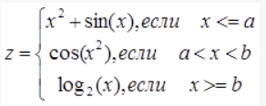

МИНИСТЕРСТВО НАУКИ  И ВЫСШЕГО ОБРАЗОВАНИЯ РОССИЙСКОЙ ФЕДЕРАЦИИ  

Федеральное государственное автономное образовательное учреждение высшего образования  

"КРЫМСКИЙ ФЕДЕРАЛЬНЫЙ УНИВЕРСИТЕТ им. В. И. ВЕРНАДСКОГО"  

ФИЗИКО-ТЕХНИЧЕСКИЙ ИНСТИТУТ  

Кафедра компьютерной инженерии и моделирования

<br/><br/>

### Отчёт по лабораторной работе № 2<br/> по дисциплине "Программирование"

<br/>

студента 1 курса группы ПИ-б-о-191(2)  

Кравченко Дмитрия Сергеевича  

направления подготовки 09.03.04 "Программная инженерия"  

<br/>


<table>

<tr><td>Научный руководитель<br/> старший преподаватель кафедры<br/> компьютерной инженерии и моделирования</td>

<td>(оценка)</td>

<td>Чабанов В.В.</td>

</tr>

</table>

<br/><br/>

Симферополь, 2019


**Лабораторная работа №2
Табулирование кусочно-заданной функции**

**Цель:**

1. Овладеть практическими навыками разработки и программирования вычислительного процесса циклической структуры;
2. Сформировать навыков программирования алгоритмов разветвляющейся структуры;
3. Изучить операторы ветвления. Особенности использования полной и сокращенной формы оператора if и тернарного оператора.

Ход работы


1)Напишите на языке С++ программу которая для функции **f(x)** на интервале  **x**  ∈ [**х**** нач **; ** x ****кон**]:

- выводит в консоль значения функции **f(x)** с шагом  **dx** ;
- определяет максимальное и минимальное значение функции.

Исходный код программы:

```c++
#include "pch.h"
#include <iostream>
#include<math.h>
#include<iomanip>

using namespace std;

int main()
{
	double a, b, h, result, startX, endX, min, max, epsilon = 0.000000000001;
	cin >> a >> b >> h >> startX >> endX;
	min = 2;
	max = 0;
	for (double i = startX; round(i*10)/10 <= round(endX*10)/10; i += h)
	{
		if (i < a || fabs(a - i) < epsilon)
		{
			result = pow(i, 2) + sin(i);
			if (result > max)
			{
				max = result;
			}
			if (result < min)
			{
				min = result;
			}
			cout << setw(7) << i << setw(10) << result << endl;
			continue;
		}
		if (a < i && i < b)
		{
			result = cos(pow(i, 2));
			if (result > max)
			{
				max = result;
			}
			if (result < min)
			{
				min = result;
			}
			cout << setw(7) << i << setw(10) << result << endl;
			continue;
		}
		if (i >= b)
		{
			result = log(i) / log(2);
			if (result > max)
			{
				max = result;
			}
			if (result < min)
			{
				min = result;
			}
			cout << setw(7) << i << setw(10) << result << endl;
			continue;
		}
	}
	cout << endl;
	cout << "Max: " << max << endl;
	cout << "Min: " << min << endl;
}

```

Точки, полученые при табуляции:


_Рис. 1. - Координаты табулированных точек_

Используя сервис Desmos, был построен график функции(функция изображена на рисунке 2), отмечены точки полученные при табуляции и точки максимума и минимума.


_Рис. 2. - График функции_



_Рис. 3. - Функция_

Вывод:в ходе проведённой лабораторной работы мы овладели навыками программирования вычислительного процесса циклической структуры, сформулировали навыки программирования алгоритмов разветвляющейся структуры, изучили операторы ветвления а также особенности полной и краткой формы условного оператора if и тернарного оператора.
