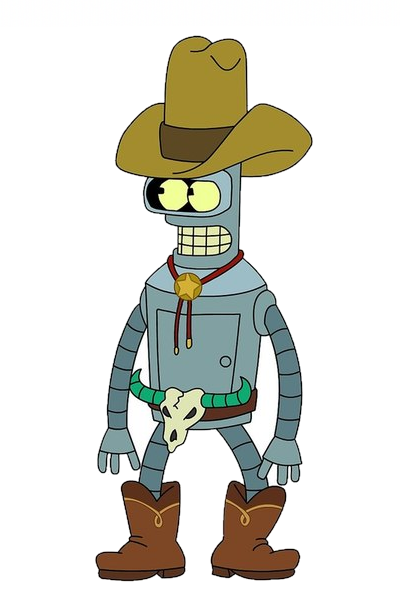

МИНИСТЕРСТВО НАУКИ  И ВЫСШЕГО ОБРАЗОВАНИЯ РОССИЙСКОЙ ФЕДЕРАЦИИ  

Федеральное государственное автономное образовательное учреждение высшего образования

"КРЫМСКИЙ ФЕДЕРАЛЬНЫЙ УНИВЕРСИТЕТ им. В. И. ВЕРНАДСКОГО"

ФИЗИКО-ТЕХНИЧЕСКИЙ ИНСТИТУТ  

Кафедра компьютерной инженерии и моделирования

<br/><br/>

### Отчёт по лабораторной работе № 3<br/> по дисциплине "Программирование"

<br/>

студента 1 курса группы ПИ-б-о-191(2)  

Кравченко Дмитрия Сергеевича  

направления подготовки 09.03.04 "Программная инженерия"  

<br/>


<table>

<tr><td>Научный руководитель<br/> старший преподаватель кафедры<br/> компьютерной инженерии и моделирования</td>

<td>(оценка)</td>

<td>Чабанов В.В.</td>

</tr>

</table>

<br/><br/>

Симферополь, 2019


**Лабораторная работа №3
Дешифровка текста из изображения**

**Цель:**

1. Закрепить навыки разработки программ использующих операторы цикла;
1. Закрепить навыки разработки программ использующих массивы;
1. Освоить методы подключения сторонних библиотек.

Ход работы

В качестве исходных данных предоставляются 6 изображение и ключ:


<i>Рис.1. - Исходное изображение</i>
Ключ: 00r 00b 00g 10r 10b 10g 01r 01b

Была написана следующая программа:

```c++
#include<libbmp.h>
#include<iostream>

using namespace std;
int bitPos = 7;
int bytePos;
char text[20000] = { 0 };
bool stop = false;

void insertBit(char bit) {
	text[bytePos] |= bit << bitPos;
	bitPos--;
	if (bitPos<0)
	{
		bitPos = 7;
		bytePos++;
	}
	if (bytePos == 1000)
	{
		stop = true;
	}
}

int main(){
	BmpImg img1;
	img1.read("pic6.bmp");
	//ключ 00r 00b 00g 10r 10b 10g 01r 01b
	setlocale(LC_ALL, "Russian");
	for (int i = 0; i < img1.get_height(); i++)
	{
		if (!stop)
		{
			for (int j = 0; j < img1.get_width(); j++) 
			{
				insertBit(img1.red_at(j, i)&1);
				insertBit(img1.blue_at(j, i)&1);
				insertBit(img1.green_at(j, i)&1);
			}
		}
	}
	cout << text<< endl;
	system("PAUSE");
}
```

Получен следующий текст:

> John Quincy Adams July 11, 1767 - February 23, 1848) was an American statesman, diplomat, lawyer, and diarist who served as the sixth president of the United States from 1825 to 1829. He previously served as the eighth United States Secretary of State from 1817 to 1825. During his long diplomatic and political career, Adams also served as an ambassador, and as a member of the United States Senate and United States House of Representatives representing Massachusetts. He was the eldest son of John Adams, who served as the second US president from 1797 to 1801, and First Lady Abigail Adams. Initially a Federalist like his father, he won election to the presidency as a member of the Democratic-Republican Party, and in the mid-1830s became affiliated with the Whig Party.
Born in Braintree, Massachusetts, Adams spent much of his youth in Europe, where his father served as a diplomat. After returning to the United States, Adams established a successful legal practice in Boston. In 1794, President George Washington appointed
Adams as the U.S.

Вывод: в ходе проведённой лабораторной работы мы закрепиили навыки написания программ, использующих операторы цикла, массивы, а такде закрепили навыки подключения сторонних библиотек.
