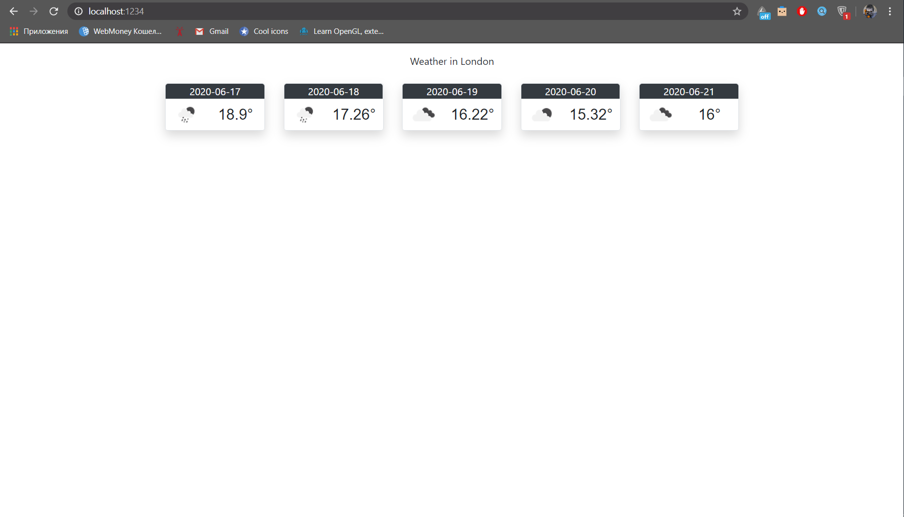

МИНИСТЕРСТВО НАУКИ  И ВЫСШЕГО ОБРАЗОВАНИЯ РОССИЙСКОЙ ФЕДЕРАЦИИ  

Федеральное государственное автономное образовательное учреждение высшего образования  

"КРЫМСКИЙ ФЕДЕРАЛЬНЫЙ УНИВЕРСИТЕТ им. В. И. ВЕРНАДСКОГО"  

ФИЗИКО-ТЕХНИЧЕСКИЙ ИНСТИТУТ  

Кафедра компьютерной инженерии и моделирования

<br/><br/>

### Отчёт по лабораторной работе № 6<br/> по дисциплине "Программирование"

<br/>

студента 1 курса группы ПИ-б-о-191(2)  

Кравченко Дмитрия Сергеевича  

направления подготовки 09.03.04 "Программная инженерия"  

<br/>


<table>


<tr><td>Научный руководитель<br/> старший преподаватель кафедры<br/> компьютерной инженерии и моделирования</td>

<td>(оценка)</td>

<td>Чабанов В.В.</td>

</tr>

</table>

<br/><br/>

Симферополь, 2019


 Лабораторная работа № 9
**Погодный информер**

**Цель:**

1. Закрепить навыки разработки многофайловыx приложений;
2. Изучить способы работы с API web-сервиса;
3. Изучить процесс сериализации/десериализации данных.

Ход работы:

*API* ключ: 294ff0e55fddbfc5799b394c46413624

```c++
#include <httplib.h>
#include <nlohmann/json.hpp>
#include <iostream>
#include<string>
 
using namespace std;

void replaceSubstr(string* strChanged, string target, string replaceWith) {

	int i = strChanged->find(target);
	strChanged->replace(i, target.length(), replaceWith);
}

void gen_response(const httplib::Request& req, httplib::Response& res) {
	fstream file("Weather.html");
	fstream test;
	test.open("test.html");
	string str;
	string allHtml;
	string* allHtmlPtr = &allHtml;
	while (!file.eof())
	{
		getline(file, str);
		allHtml += str;
	}
	
	
	httplib::Client cli("api.openweathermap.org", 80);
	nlohmann::json j;
	auto resp = cli.Get("/data/2.5/forecast?q=London&units=metric&appid=294ff0e55fddbfc5799b394c46413624");
	
	if (resp && resp->status == 200) {
		j = nlohmann::json::parse(resp->body);	
	}
	
	
	string temp = j["city"]["name"].dump();
	cout << temp;
	for (int i = 0; i < temp.length(); i++)
	{
		if (temp[i] == '\"')
		{
			temp[i] = ' ';
		}
	}
	replaceSubstr(allHtmlPtr, "{city.name}", temp);
	string date;
	string prevDate = "";
	string temperature;
	string icon;
	int counter = 0;
	int i = 0;
	int pos;
	while (true) {
		if (counter == 5)break;
		date = j["list"][i]["dt_txt"].dump();
		
		date = date.substr(0, date.find(' '));
		date.erase(0, 1);
		if (date != prevDate)
		{
			pos = allHtml.find("{list.dt}");
			allHtml.replace(pos, 9, date);
			prevDate = date;
			temperature = j["list"][i]["main"]["temp"].dump();
			pos = allHtml.find("{list.main.temp}");
			allHtml.replace(pos, 16, temperature);
			icon = j["list"][i]["weather"][0]["icon"].dump();
			icon.erase(0,1);
			icon.erase(3, 1);
			pos = allHtml.find("{list.weather.icon}");
			allHtml.replace(pos, 19, icon);
			counter++;
		}
		i++;
	}
	
res.set_content(allHtml, "text/html");
}

int main() {
	httplib::Server svr;                 
	svr.Get("/", gen_response);    
	svr.listen("localhost", 80); 
}
```

Заполненный виджет



Рис. 1. Заполненный виджет

Вывод: в ходе проведённой лабораторной работы мы закрепили навыки разработки многофайловых приложений, изучили способы работы с API web-сервиса, изучили роцесс сериализации/десериализации данных.
