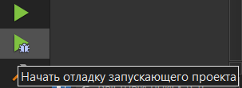
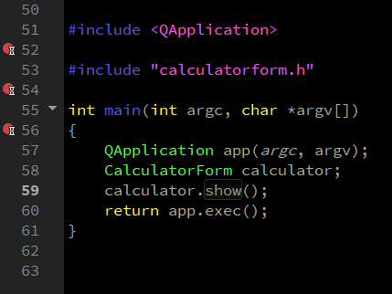
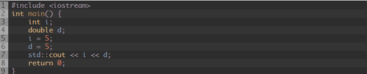
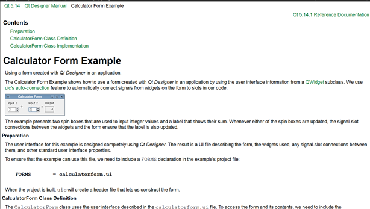

МИНИСТЕРСТВО НАУКИ И ВЫСШЕГО ОБРАЗОВАНИЯ РОССИЙСКОЙ ФЕДЕРАЦИИ

Федеральное государственное автономное образовательное учреждение высшего образования

&quot;КРЫМСКИЙ ФЕДЕРАЛЬНЫЙ УНИВЕРСИТЕТ им. В. И. ВЕРНАДСКОГО&quot;

ФИЗИКО-ТЕХНИЧЕСКИЙ ИНСТИТУТ

Кафедра компьютерной инженерии и моделирования

### **Отчёт по лабораторной работе № 7
по дисциплине &quot;Программирование&quot;**

студента 1 курса группы ПИ-б-о-191(2)

Кравченко Дмитрия Сергеевича

направления подготовки 09.03.04 &quot;Программная инженерия&quot;

 

<table>

<tr><td>Научный руководитель  старший преподаватель кафедры  компьютерной инженерии и моделирования</td>

<td>(оценка)</td>

<td>Чабанов В.В.</td>

</tr>

</table>

  

Симферополь, 2019

**Лабораторная работа №7 Изучение базовых возможностей IDE Qt Creator**

**Цель:** изучить основные возможности создания и отладки программ в IDE Qt Creator.

## **Ход работы**

Ответьте на вопросы и выполните действия перечисленные ниже.

1. Как создать консольное приложение С++ в IDE Qt Creator без использования компонентов Qt?
**Внимание!**  Путь к проекту не должен содержать русских символов, т.к. это может привести к ошибкам во время сборки.

Ответ: нужно вызвать диалоговое окно создания проекта и в левом списке выбрать пункт **Проект без**  **Qt** а в центральном **Приложение на язаке С++**.

Рис.  1 проект без Qt

1. Как изменить цветовую схему (оформление) среды?

Ответ: нужно вызвать диалоговое окно параметров через пункт **Инструменты** главного меню, в левом списке выбрать пункт **Среда** , во вкладке **Интерфейс** есть возможность изменить цветовую схему среды.

Рис.  2настройка цветовой схемы

1. Как закомментировать/раскомментировать блок кода средствами Qt Creator?

Ответ: нужно либо выделить нужный блок кода и вызвать контекстное меню на выделении и в нём выбрать пункт **Закоментировать\Раскоментировать** , либо нужно выделить нужный блок кода и воспользоваться сочетанием клавиш **Ctrl**  **+ /**

Рис.  3 комментирование блока кода

1. Как открыть в проводнике Windows папку с проектом средствами Qt Creator?

Ответ: нужно в обозревателе проекта вызвать контекстное меню на пункте **Исходники** и выбрать пункт **Показать в проводнике**.

Рис.  4 просмотр файлов проекта в проводнике

1. Какое расширение файла-проекта используется Qt Creator?

Ответ: .pro

1. Как запустить код без отладки?

Ответ: нажать на кнопку **Запустить**  или воспользоваться сочетанием клавиш ** Ctrl ** + ** R**

Рис.  5 запуск без отладки

1. Как запустить код в режиме отладки?

Ответ: нажать на кнопку **Начать отладку запускающего проекта** или нажать клавишу **F** ** 5**

Рис.  6 запуск в режиме отладки

1. Как установить/убрать точку останова (breakpoint)?

Ответ: точки останова устанавливаются в области слева от нумерации строк с помощью клика левой кнопкой мыши.

Рис.  7 точки останова

1. Создайте программу со следующим кодом:

Рис.  8 код

- Переключитесь в конфигурацию сборки «Отладка»;
- Установите breakpoint на 5, 6 и 7 строках;
- Запустите приложение щелкнув по кнопке с изображением жука .
- Используйте эту же кнопку для перехода к следующей точке останова;
- Какое значение содержит переменная i в 5й строке?
- Какое значение содержит переменная d в 6й строке?
- Какие значение содержатся в переменных i и  d в 7й строке?
- Совпадают ли эти значения с теми, что вы получали в MSVS для соответствующих типов?

Ответ: в 5й строке переменная I = 0, в 6й строке переменная d = 4.762848e-317, в 7й строке переменная I = 5 переменная d = 5.

Значения отличаются для переменной типа int, во время обявления компилятор неявно инициализировал её нулём

1. Закройте проект и перейдите на вкладку «Начало» =\&gt; «Примеры»;

Рис.  9 примеры шаблонов

1. Выберитепроект «Calculator Form Example». Для этого можно воспользоваться строкой поиска;
2. Изучите (по желанию) описание проекта в открывшемся окне;

Рис.  10 справка по форме калькулятора

1. Сейчас вы находитесь на вкладке «Проекты». Выберите комплект сборки. На рис. 1 присутствует только один комплект, но их может быть больше, например для сборки под Android или компилятором MSVS;

Рис.  11 настройка проекта

1. Перейдите на вкладку «Редактор» и запустите сборку проекта;
2. В инспекторе проекта выберите файл «main.cpp». В этом файле установите курсор на слово «show» в строке show(); и нажмите F1. Изучите справочную информацию. Таким же образом можно получить справку по любому объекту/методу/полю доступному в Qt;

Рис.  12 справка по методу show

1. В инспекторе проекта выберите файл «Формы» =\&gt; «calculatorform.ui» и дважды счёлкните ЛКМ;

Рис.  13вкладка Дизайн

1. Вы попали на вкладку «Дизайн». На форме замените английский текст на русский. Пересоберите проект.

Рис.  14 редактирование надписей в форме

Вывод: в ходе проведённой лабораторной работы мы изучили основные возможности создания и отладки программ в IDEQtCreator.
