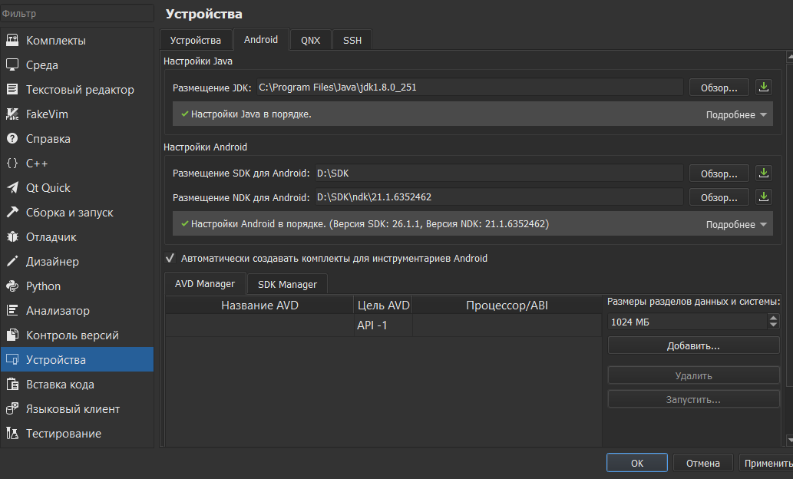
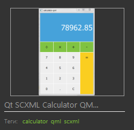
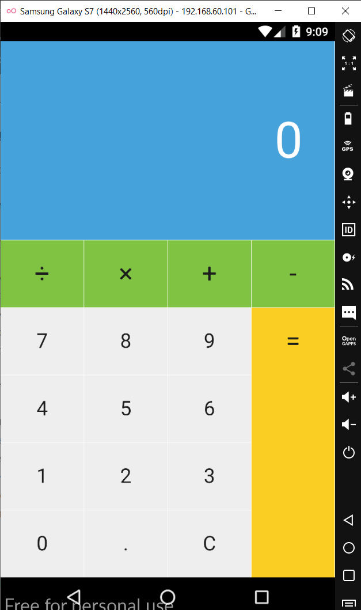

МИНИСТЕРСТВО НАУКИ  И ВЫСШЕГО ОБРАЗОВАНИЯ РОССИЙСКОЙ ФЕДЕРАЦИИ  

Федеральное государственное автономное образовательное учреждение высшего образования  

"КРЫМСКИЙ ФЕДЕРАЛЬНЫЙ УНИВЕРСИТЕТ им. В. И. ВЕРНАДСКОГО"  

ФИЗИКО-ТЕХНИЧЕСКИЙ ИНСТИТУТ  

Кафедра компьютерной инженерии и моделирования

  

### Отчёт по лабораторной работе № 8  по дисциплине "Программирование"

 

студента 1 курса группы ПИ-б-о-191(2)  

Кравченко Дмитрия Сергеевича  

направления подготовки 09.03.04 "Программная инженерия"  

 

<table>

<tr><td>Научный руководитель  старший преподаватель кафедры  компьютерной инженерии и моделирования</td>

<td>(оценка)</td>

<td>Чабанов В.В.</td>

</tr>

</table>

  

Симферополь, 2019

 Лабораторная работа №
**Настройка Qt Creator для разработки приложений под android**

**Цель:**

1. Настроить IDE Qt Creator для разработки приложений под android ОС;
2. Изучить базовые понятия связанные с мобильной разработкой;
3. Научиться создавать мобильные приложения при помощи фреймворка Qt 5.14.

Ход работы

1) Проведена настройка Qt Creator для разработки приложений под андроид.

*Рис. 1. Настройка Qt Creator*

2) В качестве приложения был выбран калькулятор Qt SCXML Calculator QML.

*Рис. 2. Приложение калькулятор*

3) Была произведена сборка проекта и установка приложения на эмулируемое устройство.

*Рис. 3. Запущенное приложение*

Вывод: в ходе проведённой лабораторной работы мы ознакомились с набором программных средств, необходимых для создания приложения для ОС Android и приобрели навыки их использования.