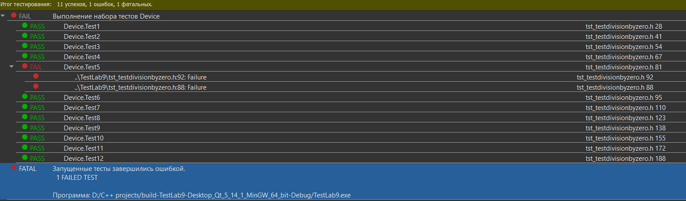

МИНИСТЕРСТВО НАУКИ  И ВЫСШЕГО ОБРАЗОВАНИЯ РОССИЙСКОЙ ФЕДЕРАЦИИ  

Федеральное государственное автономное образовательное учреждение высшего образования  

"КРЫМСКИЙ ФЕДЕРАЛЬНЫЙ УНИВЕРСИТЕТ им. В. И. ВЕРНАДСКОГО"  

ФИЗИКО-ТЕХНИЧЕСКИЙ ИНСТИТУТ  

Кафедра компьютерной инженерии и моделирования

<br/><br/>

### Отчёт по лабораторной работе № 9<br/> по дисциплине "Программирование"

<br/>

студента 1 курса группы ПИ-б-о-191(2)  

Кравченко Дмитрия Сергеевича  

направления подготовки 09.03.04 "Программная инженерия"  

<br/>


<table>


<tr><td>Научный руководитель<br/> старший преподаватель кафедры<br/> компьютерной инженерии и моделирования</td>

<td>(оценка)</td>

<td>Чабанов В.В.</td>

</tr>

</table>

<br/><br/>

Симферополь, 2019


 Лабораторная работа № 9
**Тестирование при помощи Google Test Framework**

**Цель:**

1. Познакомиться с Google Test и Google Mock Framework;
2. Изучить базовые понятия относящийся к тестированию кода;
3. Научиться тестировать классы в среде разработки Qt Creator.

Ход работы

Ссылка на проект с тестами: https://github.com/DDiometr/worksProgramming/tree/master/labs/lab9/TestLab9

Итог тестирования:



Реализация метода lockDoor, которая работает:

```c++
DoorStatus LockController::lockDoor()
{
    return latch->close();
}
```

Предположение по поводу причин возникновения ошибки:

Название метода lockDoor похоже на название метода unlockDoor. Программист решил что проще создать метод lockDoor скопировав метод unlockDoor и отредактировав его копию. Программист сменил название, но забыл поменять вызов функции open на вызов функции close.


Вывод: в ходе проведённой лабораторной работы мы познакомились с Google Test и Google Mock Framework, изучили базовые понятия относящиеся к тестированию кода, научились тестировать классы в среде разработки  Qt Creator.

